# Creando una Red Social

## Índice

- [1. Introduccion](#1-introduccion)
- [2. Resumen del proyecto](#2-resumen-del-proyecto)
- [3. Decisiones de diseño del proyecto](#3-decisiones-de-diseño-del-proyecto)
- [4. Funcionalidad](#4-funcionalidad)
- [5. Consideraciones generales](#5-consideraciones-generales)

## 1. Introducción:

Te presentamos una red social para mascotas llamada Happy Pets, en la que los usuarios podrán publicar artículos sobre sus mascotas.

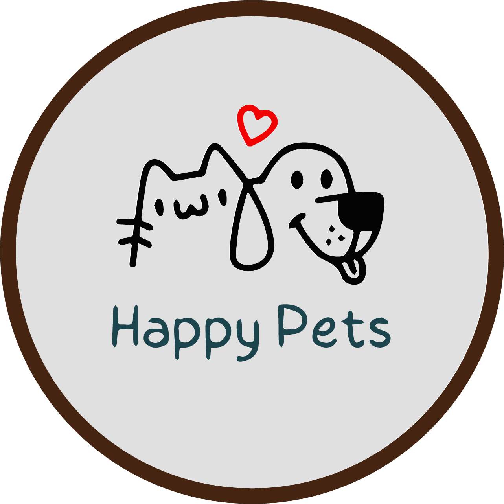

## 2. Resumen del proyecto

Happy-Pets Es una red social que ha sido creada para todos aquellos amantes de las mascotas que siempre quieren recibir o dar tips de ayuda para otros tenentes responsables, y que quieren compartir fotografias para presumir a sus mascotas.

Esta página le permitirá registrarse con su nombre, correo electrónico y contraseña o también podrá iniciar sesión con su cuenta de google para luego poder acceder a la Home, que es el feed donde podrá hacer sus publicaciones.

### Principales usuarios

Los principales usuarios son todas aquellas personas amantes de las mascotas (perros y gatos), ya que en esta red social podrán compartir todo sobre sus mascotas como: tips, consejos, recomendaciones, etc.

## 3. Decisiones de diseño del proyecto:

### Sobre el sitio web

¿Por qué Happy-Pets?

El nombre nace por ambos conceptos que serán empleados en nuestro sitio y que tiene justamente que ver con las mascotas felices y sus tenentes responsables.

### Investigación

Para la investigación hemos visitado variados sitios de redes sociales para mascotas, páginas enfocadas a la salud de peluditos y publicaciones similares, de allí hemos tomado los principales ideas que usan la mayoria de los sitios junto con lo que más publican las personas y es por eso que tenemos los siguientes resultado en las decisiones del diseño:

### Decisiones de diseño basados en la investigación:

Hemos decidido usar el color la siguiente paleta de colores ya que este llama la atención visualmente y es muy usado en sitios de mascotas.

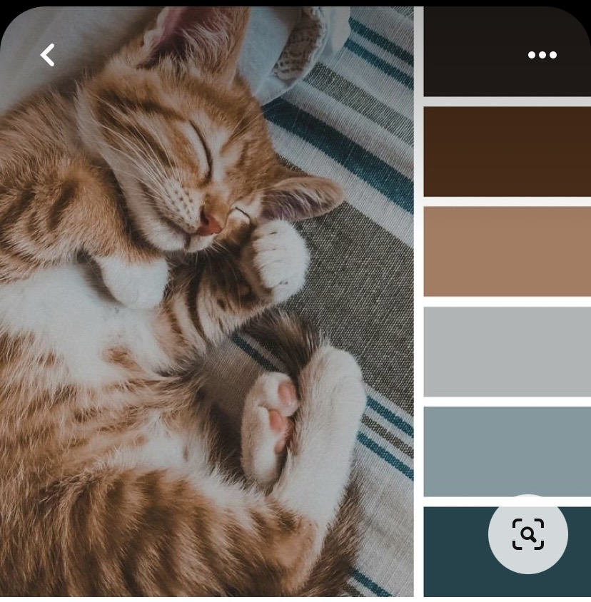

En base a lo investigado hemos decidido tambien crear una sección para publicar post con tips ya que nuestros encuestados lo pidideron y por que es común que las personas quieran ver y compartir tips de mascotas, con esto le damos un plus a nuestro sitio.

**Encuesta**

Realizamos una encuesta mediante formulario de Google y luego la compartimos de manera pública.

Puedes ver las preguntas haciendo [click aquí.](https://docs.google.com/forms/d/1HlqoZLrLHU9HN4IlXr_InlvY0mu6WpbkD4MfunywrB8/viewform?edit_requested=true)

Resultados Encuesta:

Total personas encuestadas: 35

Pregunta 1

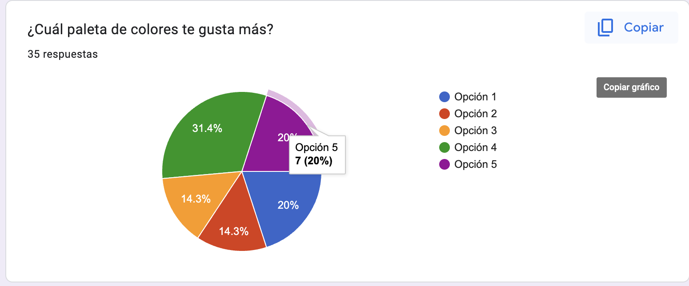

Pregunta 2

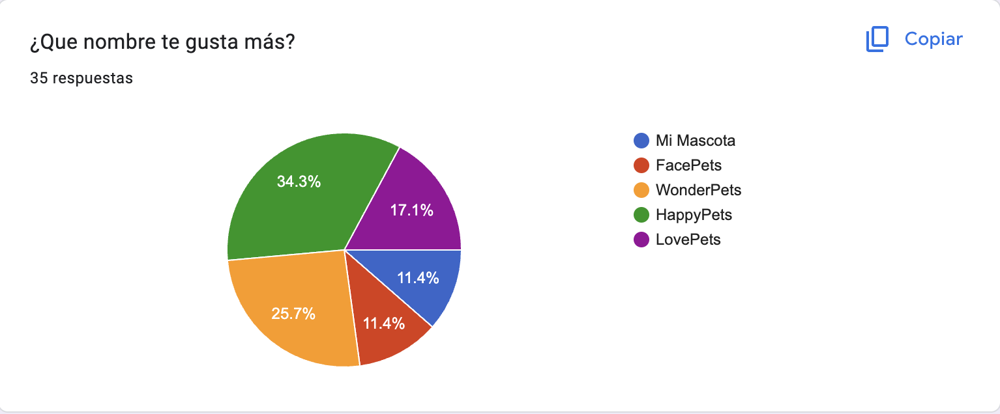

Pregunta 3

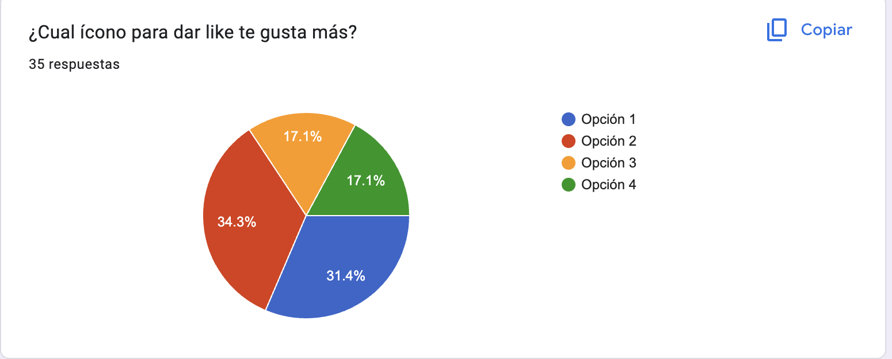

Pregunta 4

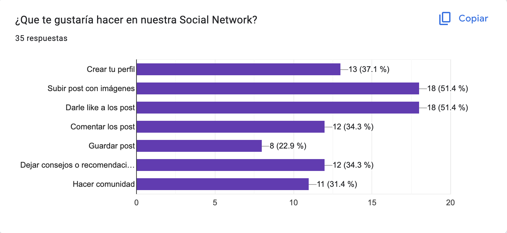

Los usuarios son mujeres y hombres, quienes han tenido alguna vez en su vida una o más mascotas, lo esencial era saber si estarían interesados en compartir con otras personas fotografías de sus mascotas y/o tips sobre salud y nutrición de sus peluditos.

**Prototipo Baja Fidelidad**

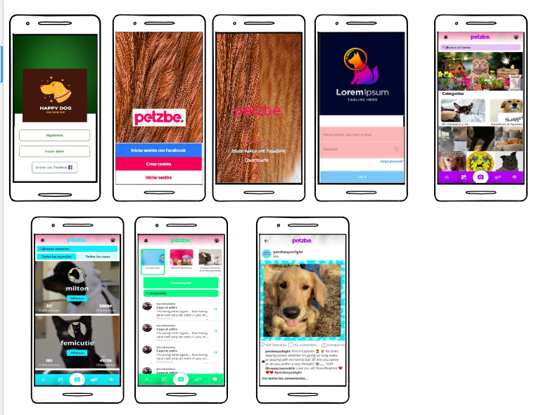

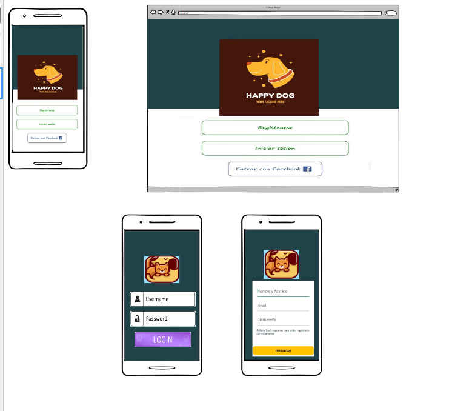

**Prototipo Alta Fidelidad**

Realizamos la interfaz de usuario en la aplicación [Figma](https://www.figma.com/), a continiación puedes ver los prototipos hechos:

- Versión Movil

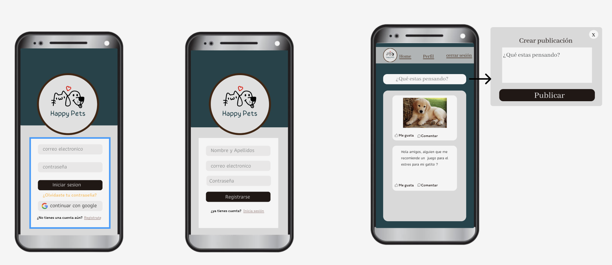

- Versión Desktop

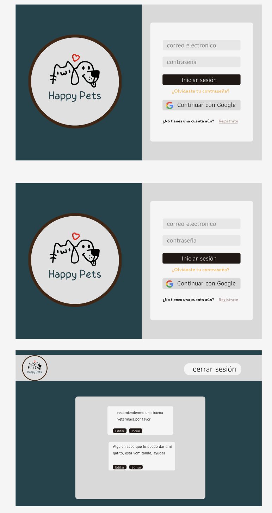

## 4. Funcionalidad:

Te mostraré paso a paso las funcionalidades que tiene esta red social y para ello nos basamos en historias de usuario.

### Historia de usuario Nº01 - Crear una cuenta con email y contraseña.

#### Descripción:

Como usuario nuevo debo poder crear una cuenta con email y password válidos para poder iniciar sesion e ingresar a la red social

#### Criterios de aceptación:

- Debe ser responsive
- No debe necesitar recargar la página para crear una cuenta (SPA)
- No pueden haber usuarios repetidos.
- Lo que se escriba en el campo (input) de contraseña debe ser secreto.

#### Definición de terminado:

- La funcionalidad cumple satisface los criterios de aceptación.
- La funcionalidad cubre test unitario con un mínimo de 70%.
- El diseño visual corresponde al prototipo de alta fidelidad.
- La funcionalidad esta desplegada y pública para ser probada.
- La funcionalidad fue probada manualmente.
- Se hicieron pruebas de usuabilidad.

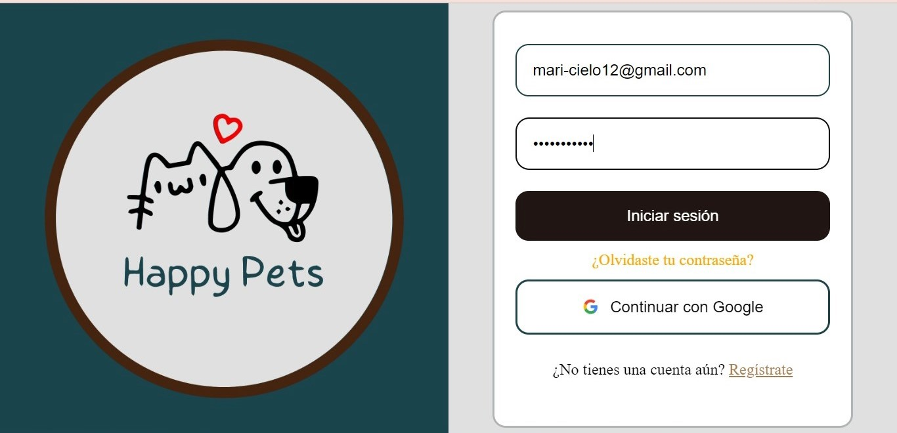

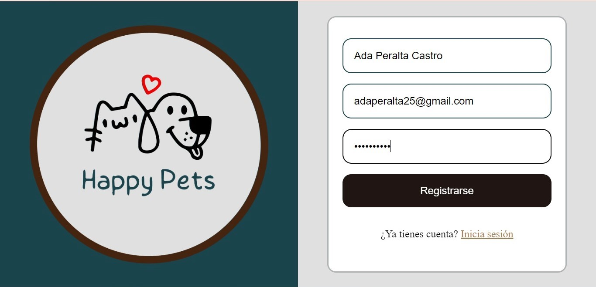

### Historia de usuario Nº02 - Iniciar sesión con Google.

#### Descripción:

Como usuario nuevo debo poder tener la opción de iniciar sesión con mi cuenta de Google para ingresar a la red social sin necesidad de crear una cuenta de email válido.

#### Criterios de aceptación:

- mostrar la opción de ingresar a la red social con Google.
- Debe ser responsive
- No debe necesitar recargar la página para crear una cuenta (SPA)

#### Definición de terminado:

- La funcionalidad cumple satisface los criterios de aceptación.
- La funcionalidad cubre test unitario con un mínimo de 70%.
- El diseño visual corresponde al prototipo de alta fidelidad.
- La funcionalidad esta desplegada y pública para ser probada. (GitHub)
- La funcionalidad fue probada manualmente.
- Se hicieron pruebas de usuabilidad.

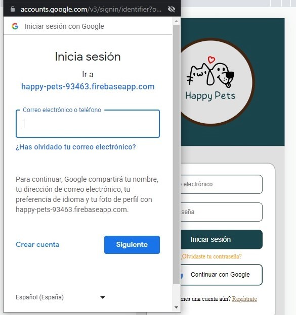

### Historia de usuario Nº03 - Postear, dar like, editar y borrar los post.

#### Descripción:

Como usuario ya logueado debo poder hacer una publicación de un post, dar y quitar el like y como dueño del post tambien puedo editar y borrar mi propio post.

#### Criterios de aceptación:

- mostrar un boton que abre un modal para poder crear un post.
- Debe ser responsive.
- No debe necesitar recargar la página para crear una cuenta (SPA)

#### Definición de terminado:

- La funcionalidad cumple satisface los criterios de aceptación.
- La funcionalidad cubre test unitario con un mínimo de 70%.
- El diseño visual corresponde al prototipo de alta fidelidad.
- La funcionalidad esta desplegada y pública para ser probada. (GitHub)
- La funcionalidad fue probada manualmente.
- Se hicieron pruebas de usuabilidad.

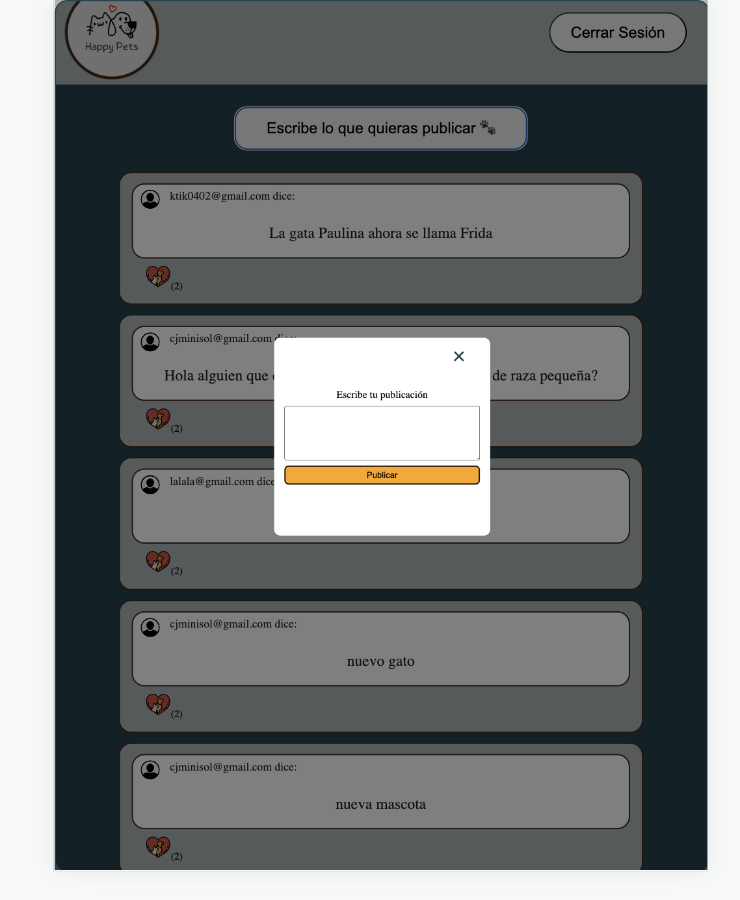

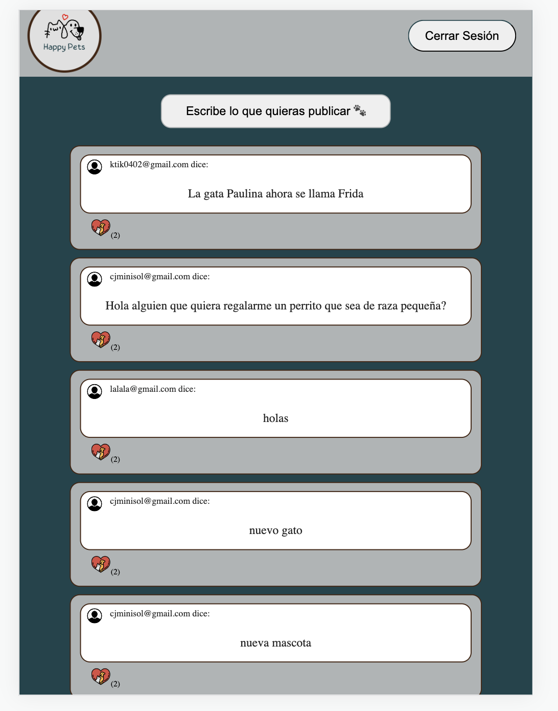

## 5. Consideraciones generales

- Este proyecto lo trabajamos en equipo de tres.

- El tiempo que nos tomó completar el proyecto fue de 6 Sprints.

- La lógica del proyecto está implementada completamente en JavaScript
  (ES6+), HTML y CSS :smiley:. Para este proyecto **no utilizamos**
  _frameworks_ o librerías de CSS y JS.
