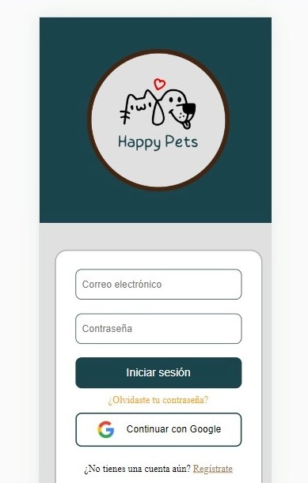
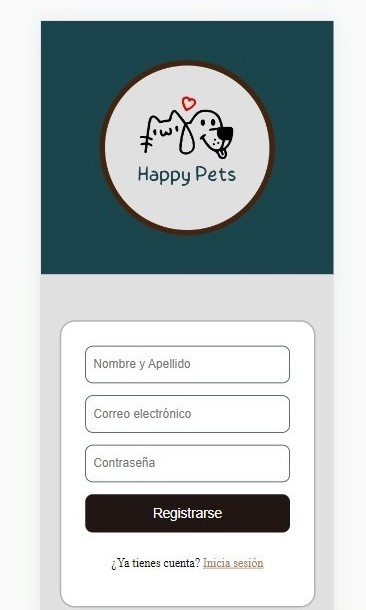

# Creando una Red Social

## Índice

* [1. Introduccion](#1-introduccion)
* [2. Resumen del proyecto](#2-resumen-del-proyecto)
* [3. Decisiones de diseño del proyecto](#3-decisiones-de-diseño-del-proyecto)
* [4. Funcionalidad](#4-funcionalidad)

## 1. Introducción:

Te presentamos una red social para mascotas llamada Happy Pets, en la que los usuarios podrán publicar artículos sobre sus mascotas.

## 2. Resumen del proyecto

Happy-Pets  Es una red social que ha sido creada para todos aquellos  amantes de las mascotas  que siempre quieren recibir o dar tips de ayuda para otros tenentes responsables, y que quieren compartir fotografias para presumir a sus mascotas.

Esta página le permitirá registrarse con su nombre, correo electrónico y contraseña o también podrá iniciar sesión con su cuenta de google para luego poder acceder a la Home, que es el feed donde podrá hacer sus publicaciones.

### Principales usuarios

* Los principales usuarios son todas aquellas personas amantes de las mascotas (perros y gatos), ya que en esta red social podrán compartir todo sobre sus mascotas como: tips, consejos, recomendaciones, etc.

## 3. Decisiones de diseño del proyecto:

### Sobre el sitio web

¿Por qué Happy - Pets?

El nombre nace por ambos conceptos que serán empleados en nuestro sitio y que tiene justamente que ver con las mascotas felices y sus tenentes responsables.

### Investigación

* Para la investigación hemos visitado variados sitios de redes sociales para mascotas, páginas enfocadas a la salud de peluditos y publicaciones similares, de allí hemos tomado los principales ideas que usan la mayoria de los sitios junto con lo que más publican las personas y es por eso que tenemos los siguientes resultado en las decisiones del diseño:

### Decisiones de diseño basados en la investigación:

Hemos decidido usar el color la siguiente paleta de colores ya que este llama la atención visualmente y es muy usado en sitios de mascotas.

En base a lo investigado hemos decidido tambien crear una sección para publicar post con tips ya que nuestros encuestados lo pidideron y por que es común que las personas quieran ver y compartir tips de mascotas, con esto le damos un plus a nuestro sitio.

* Encuesta

Realizamos una encuesta mediante formulario de Google y luego la compartimos de manera pública.

Puedes ver las preguntas haciendo [click aquí.](https://docs.google.com/forms/d/1HlqoZLrLHU9HN4IlXr_InlvY0mu6WpbkD4MfunywrB8/viewform?edit_requested=true)

Resultados Encuesta
Total personas encuestadas: 35

Pregunta 1

Pregunta 2

Pregunta 3

Pregunta 4

Los usuarios son mujeres y hombres , quienes han tenido alguna vez en su vida una o más mascotas, lo escencial era saber si estarian interesados en compartir con otras personas fotografías de sus mascotas y/o tips sobre salud y nutrición de sus peluditos.

* Prototipo Alta Fidelidad

Realizamos la interfaz de usuario en la aplicación [Figma](https://www.figma.com/), a continiación puedes ver los prototipos hechos:

**Versión Movil**

**Versión Tablet**

**Versión Desktop**

## 4. Funcionalidad:

Te mostraré paso a paso las funcionalidades que tiene esta red social y para ello nos basamos en historias de usuario.

### Historia de usuario Nº01-Crear una cuenta con email y contraseña.

## Descripción:
- [ ] **Diseñar y desarrollar un producto o servicio poniendo a las usuarias en el centro**

### Diseño de producto

- [ ] **Crear prototipos de alta fidelidad que incluyan interacciones**

- [ ] **Seguir los principios básicos de diseño visual**

### Investigación

- [ ] **Planear y ejecutar testeos de usabilidad de prototipos en distintos niveles de fidelidad**

  

Links

  * [Intro a testeos usabilidad](https://coda.io/@bootcamp-laboratoria/contenido-ux/test-de-usabilidad-15)
  * [Pruebas con Usuarios 1 — ¿Qué, cuándo y para qué testeamos?](https://eugeniacasabona.medium.com/pruebas-con-usuarios-1-qu%C3%A9-cu%C3%A1ndo-y-para-qu%C3%A9-testeamos-7c3a89b4b5e7)

## 4. Consideraciones generales

* Este proyecto se debe trabajar en equipos de tres.

* El rango de tiempo estimado para completar el proyecto es de 4 a 5 Sprints.

* La lógica del proyecto debe estar implementada completamente en JavaScript
  (ES6+), HTML y CSS :smiley:. Para este proyecto **no está permitido** utilizar
  _frameworks_ o librerías de CSS y JS.

* La división y organización del trabajo debe permitir, sin excepciones, que
  **cada integrante** del equipo practique el aprendizaje de todo lo involucrado
  en **cada historia**. _No se dividan el trabajo como en una fábrica._
  - ¿Hasta acá has avanzado en tus proyectos con cierta fluidez y sin mayores
    problemas? Sé generosa con tus compañeras, permíteles aprender y practicar
    sin restricciones, aunque tome un poco más de tiempo. Aproveha de
    _coachearlas_, de hacer _pair programming_, una de las mejores maneras de
    aprender es explicando verbalmente.

  - ¿Se te está haciendo difícil y te cuesta un poco más avanzar? No te quedes
    con las partes "fáciles" del proyecto, conversa, negocia, exige tu oportunidad
    para practicar y aprender lo que se te hace más difícil.

* Solamente pueden trabajar en una única historia por vez, no pueden avanzar a
  la siguiente sin haber completado la anterior. La historia se completa cuando
  se cumplen **todos** sus Criterios de Aceptación + **toda** su Definición
  de Terminado.

Para comenzar tendrás que hacer un _fork_ y _clonar_ este repositorio.

